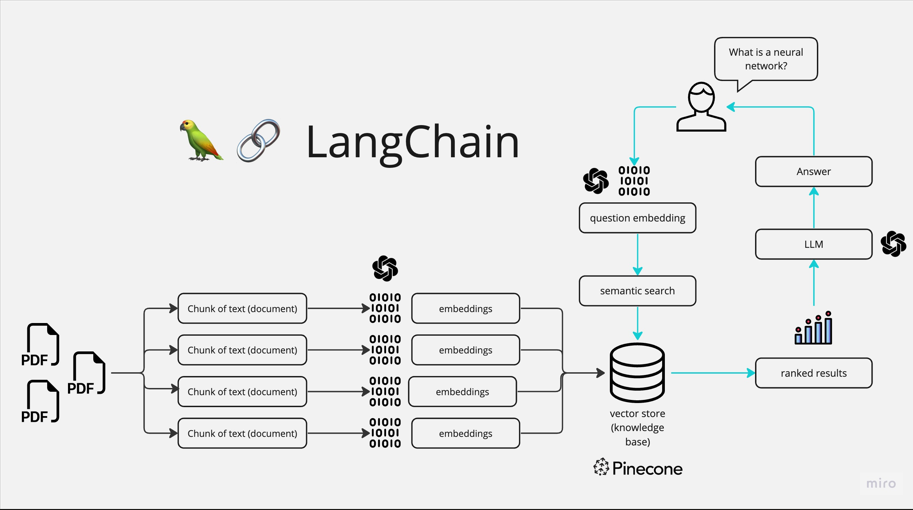

# Gemini Multi-PDF Chatbot (Dockerized)

**Access the deployed application directly at:** [https://chat-with-pdfs-udouqrabxvtk5axzfotmnz.streamlit.app/](https://chat-with-pdfs-udouqrabxvtk5axzfotmnz.streamlit.app/)

This Streamlit application allows you to interact with multiple PDF documents using Google's Gemini language model. It provides functionalities to:

[](images/langchain-working.png)

* **Chat with PDFs:** Ask questions and get answers based on the content of your uploaded PDF files. This core feature lets users upload PDF documents and then ask questions about the content within those PDFs. The application uses LangChain and Google's Gemini model to provide answers based on the information found in the PDFs.
* **Merge PDFs:** Combine multiple PDF files into a single document. This feature allows users to combine multiple separate PDF files into a single, unified PDF document. This is useful for organizing and consolidating information from various sources.
* **Extract Images from PDF:** Extract images from a single uploaded PDF. Users can extract all the images embedded within a PDF document. This is helpful for retrieving visual content from PDFs.
* **Convert PDF Images to Text (OCR):** Convert images within PDFs to text. This feature uses Optical Character Recognition (OCR) to convert images within PDF files into editable text. This is essential for accessing and searching text that is stored as images in PDFs.

## Getting Started

### Prerequisites

* **Python 3.7+**
* **A Google Cloud Platform project with the Gemini API enabled.**
* **A Google API key.**
* **Docker Desktop:** Ensure you have Docker Desktop installed on your system. You can download it from [Docker's official website](https://www.docker.com/products/docker-desktop/).

### Installation (Python Virtual Environment)

1.  **Clone the repository:**

    ```bash
    git clone [https://github.com/kgurnoor/gemini_multipdf_chat.git](https://github.com/kgurnoor/gemini_multipdf_chat.git)
    cd gemini_multipdf_chat
    ```

2.  **Create a virtual environment (recommended):**

    ```bash
    python -m venv venv
    source venv/bin/activate   # On macOS/Linux
    venv\Scripts\activate   # On Windows
    ```

3.  **Install the required packages:**

    ```bash
    pip install -r requirements.txt
    ```

4.  **Create a `.env` file:**

    Create a file named `.env` in the root directory of the project and add your Google API key:

    ```
    GOOGLE_API_KEY=YOUR_GOOGLE_API_KEY
    ```

    Replace `YOUR_GOOGLE_API_KEY` with your actual API key.

### Running the Application (Python Virtual Environment)

1.  **Run the Streamlit application:**

    ```bash
    streamlit run app.py
    ```

2.  **Access the application:**

    Open your web browser and go to `http://localhost:8501`.

### Docker Instructions

If you prefer to run the application using Docker:

1.  **Build the Docker Image:**

    Navigate to the project directory in your terminal and run the following command:

    ```bash
    docker build -t gemini-pdf-chat-app .
    ```

    This command builds the Docker image using the `Dockerfile` in the repository. Docker will read the `Dockerfile` and execute the instructions to create the image. This process might take a while, especially the first time, as Docker downloads the base image and installs dependencies.

2.  **Run the Docker Container:**

    After the image is built successfully, run the container:

    ```bash
    docker run -p 8501:8501 -e GOOGLE_API_KEY=your_google_api_key gemini-pdf-chat-app
    ```

    Replace `your_google_api_key` with your actual Google Gemini API key. Docker will start the container, and Streamlit will start running your application. The terminal will show Streamlit's output, including the local and network URLs.

3.  **Access Your Streamlit Application:**

    Open your web browser and go to the local URL provided by Streamlit (usually `http://localhost:8501`). Your Streamlit application should now be running in your browser.

4.  **Stop the Docker Container (When Finished):**

    To stop the running Docker container, go back to your terminal and press `Ctrl + C`. Alternatively, you can open a new terminal window, then run the command `docker ps` to get a list of running containers, then run the command `docker stop container_name` where `container_name` is the name of the container.

5.  **Clean Up (Optional):**

    * To remove the stopped container, use the `docker rm` command:

        ```bash
        docker rm [container_name_or_id]
        ```

    * To remove the Docker image, use the `docker rmi` command:

        ```bash
        docker rmi gemini-pdf-chat-app
        ```

    * Use caution when removing images, as you'll need to rebuild them if you want to run the application again.

### Using the Application

1.  **Upload PDF files:** Use the file uploader in the sidebar to upload one or more PDF files.
2.  **Submit and Process:** Click the "Submit & Process" button to process the PDFs and create a vector store.
3.  **Chat with PDFs:** Enter your question in the chat input and press Enter.
4.  **Merge PDFs:** Upload two or more PDF files and click "Merge PDFs" to download a merged PDF.
5.  **Extract Images:** Upload a single PDF and click "Extract Images from PDF" to view the extracted images.
6.  **Convert Images to Text (OCR):** Upload one or more PDFs, and click “Convert PDF images to Text” to view the text.
7.  **Clear:** Click the "Clear" button to clear the chat history and any processed data.

### Deploying your application to the cloud (Docker)

First, build your image, e.g.: `docker build -t myapp .`.

If your cloud uses a different CPU architecture than your development machine (e.g., you are on a Mac M1 and your cloud provider is amd64), you'll want to build the image for that platform, e.g.: `docker build --platform=linux/amd64 -t myapp .`.

Then, push it to your registry, e.g. `docker push myregistry.com/myapp`.

This Docker image can be deployed to various container orchestration platforms such as:

* **Google Cloud Run**
* **AWS Elastic Beanstalk**
* **Heroku (with Docker support)**
* **DigitalOcean App Platform**

Consult Docker's [getting started](https://docs.docker.com/go/get-started-sharing/) docs for more detail on building and pushing.

### References

* [Docker's Python guide](https://docs.docker.com/language/python/)
* [Streamlit Documentation](https://streamlit.io/)
* [LangChain Documentation](https://python.langchain.com/docs/get_started/introduction)
* [Google Generative AI Documentation](https://ai.google.dev/)
* [Google Cloud Platform Documentation](https://cloud.google.com/docs)
* [Python venv Documentation](https://docs.python.org/3/library/venv.html)
* [Git Documentation](https://git-scm.com/doc)